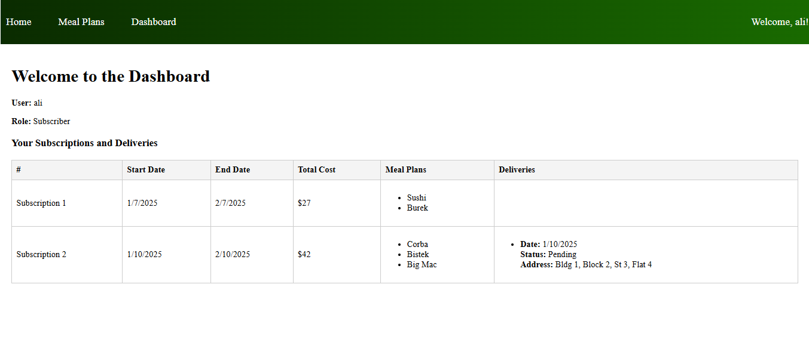

# MealMate

## Live Deployment

You can try out the live version of the project here:  
🔗 [My Live Demo](https://mealmate.surge.sh)

## Background

- MealMate is a web-based food ordering system built using the MERN stack, designed to streamline the process of ordering and managing meals. The platform offers an intuitive interface where users can browse menus, choose their preferred meal plans, and customize their orders. Powered by Node.js and Express.js, the back-end ensures fast order processing and secure transactions, while MongoDB stores user data and order history. With a responsive front-end built in React, MealMate provides a seamless, user-friendly experience for selecting meals, entering delivery details, and completing payments. Whether for one-time orders or subscriptions, FoodieHub makes food delivery quick and easy.

## User Stories

- As a user I want to sign in to my account.
- As a user I want to create a new account, and manage my Plans.
- As a user I want to choose my meals.
- As a user I want to view the list of meals.
- As a user I want to view meal details.
- As a user I want to see food categorized by preference.
- As a user I can add my delivery details and add more than one address.
- As a user I can edit my profile.

## Entity Relationship Diagrams (ERD)

Entity relationship diagrams (ERDs) are a way to describe the data that will be used in an application. Using the user stories we created above, we know we must keep track of users and listings.

**For users, we need to keep track of:**

1. Username - String, required and unique
2. Email - String, required and unique
3. Password - String, required
4. Account type - enum (admin, user), default: user

**For Subscription, we need to keep track of:**

1. StartDate - Date, required
2. Duration - Number (in months), required
3. MealsPerDay - Enum (2 or 3), required
4. Price - Number, required
5. Preferences - Array (List of Strings)

**For MealPlan, we need to keep track of:**

1. Name - String, required
2. Description - String
3. Dishes - Array (List of Strings)

**For Delivery, we need to keep track of:**

1. Delivery Date - Date, required
2. Status - Enum (Pending, Delivered), required
3. Location - String, required
4. Meals - Array (List of Strings)

## Wireframes

**First page:**  

**Sign up:**  

**Sign in:**  

**Home Page:**  

**List of Meals:**  

**Subscription Page:**  

**Delivery Page:**  

**Dashboard Page:**  

**Profile Page:**  

## Trello

**We use Trello to organize our time and make a clear plan:**  

[Trello link](https://trello.com/b/G5hQgnh9/foodapp)

## Technology Used

- MongoDB
- Express.js
- React.js
- Node.js

## Next Steps

1. Add more meal plans and meals.
2. Allow users to pause their subscriptions.
3. Enable users to change meals daily.
